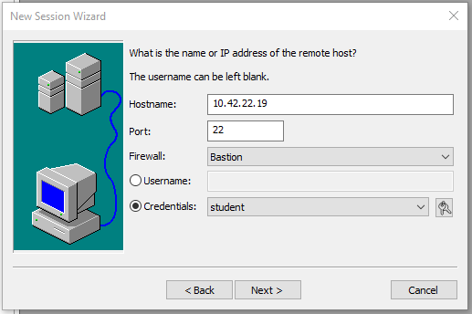
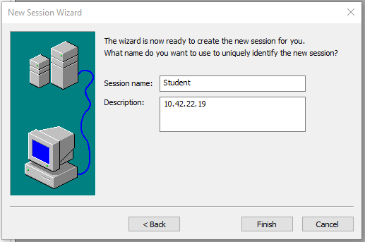

# Connect to the lab instances
## Connection options


# Connect with SSH

## SecureCRT
SecureCRT can be downloaded here: [SecureCRT](https://www.vandyke.com/cgi-bin/releases.php?product=securecrt)

### During the installation, select "Without a configuration passphrase".


### Go to Help - Enter Lincense Data and paste the license key provided.


### Go to Tools - Manage saved credentials and add the private key


### Create the bastion host session by clicking the plus sign in the session manager


### Create the student session



### (Optional) Go to Options - Edit default session to edit the theme


## Native Terminal (Linux / MAC)
Create a new file **~/.ssh/id_aws_student** and paste the provided private key.
Change the permissions of the file to 600:
```chmod 600 ~/.ssh/id_aws_student```

Edit your local ssh config file **~/.ssh/config** and add the following entries:
```
Host bastion.aws.ntslab.eu
  User student
  StrictHostKeyChecking no
  IdentityFile ~/.ssh/id_aws_student

Host 10.42.22.*
  User student
  StrictHostKeyChecking no
  IdentityFile ~/.ssh/id_aws_student
  ProxyJump bastion.aws.ntslab.eu
```
Now you can connect to the lab machine. The login is done with the private key,
no password is needed.

```ssh 10.42.22.XX```

# Connect with browser
Open your favourite browser and navigate to the guacamole URL.
After logging in, you will directly be connected to you lab machine.
