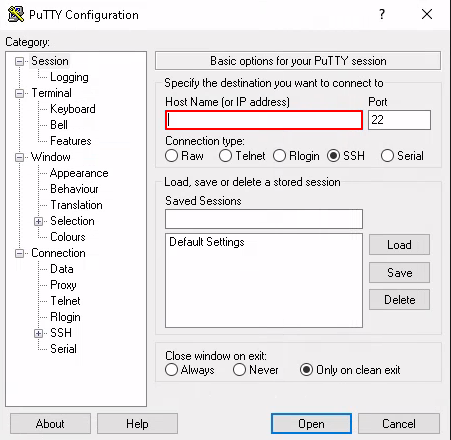
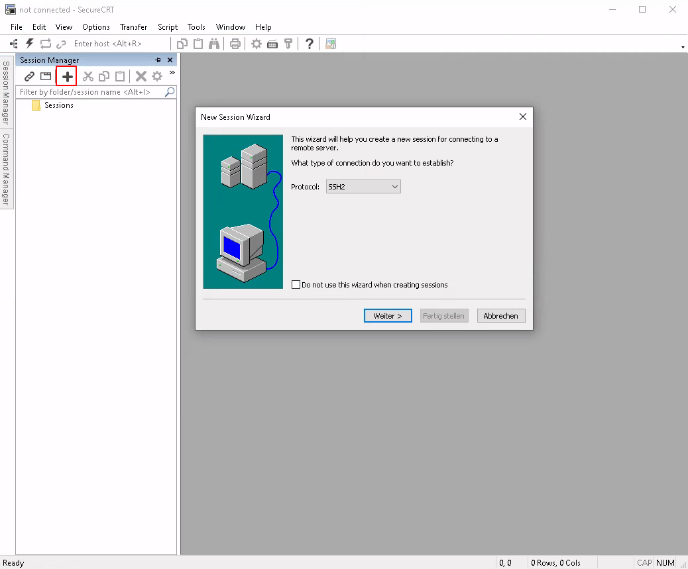
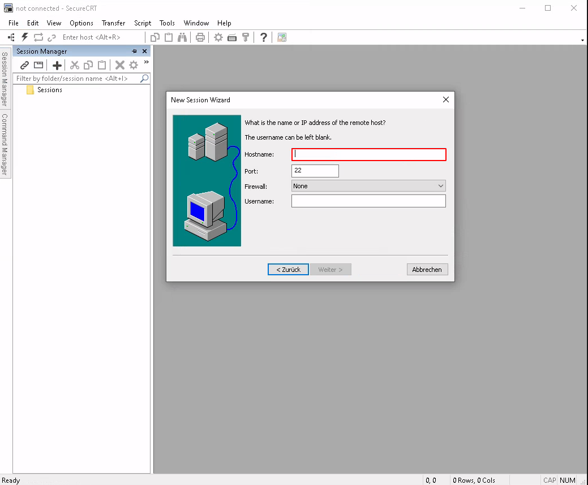

# Connect via SSH
## Windows - MAC
### Putty
Open [Putty](http://putty.org) and type the IP address of your lab linux installation. The SSH port is 22.



You can also save the session by providing a name in the "Saved Sessions" field and clicking the "Save" button.

### SecureCRT
Open [SecureCRT](https://www.vandyke.com/cgi-bin/releases.php?product=securecrt) and expand the session manager on the left side. In the session manager, click on the "Plus" button to add a new session.



Provide the IP address of your lab linux installation. The SSH port is 22.



The session is saved automatically and you can reuse it.

## Linux
No additional software is needed, just open a terminal session and directly connect via the "ssh" command.

**`ssh username@<IP address of the lab system>`**

## Tasks
### Change user password
**`passwd`**
```
dkofler@ibk-tr-deb00:~$ passwd
Changing password for dkofler.
Current password:
New password:
Retype new password:
```