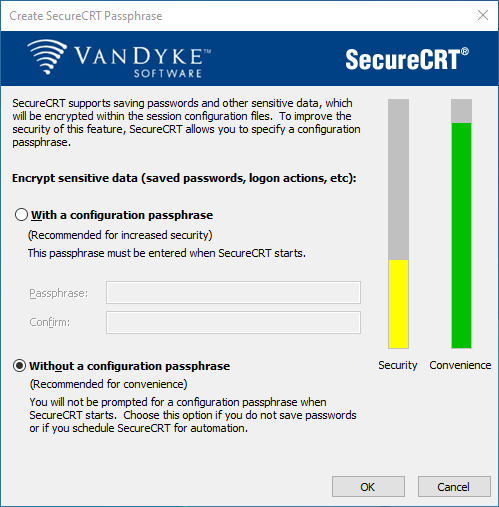
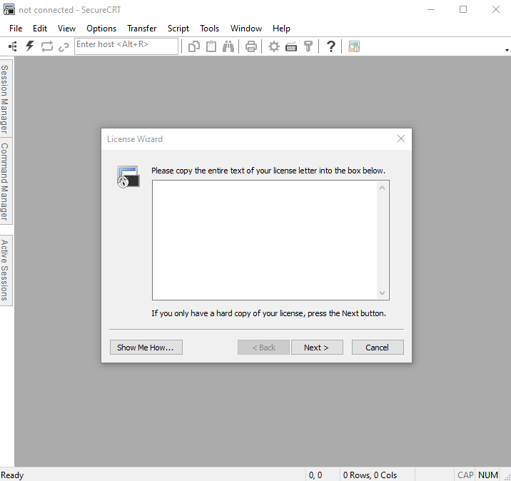
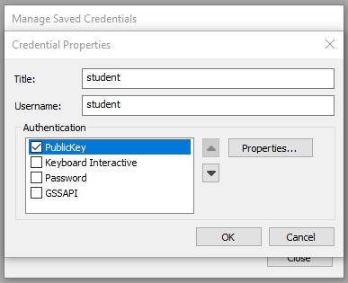
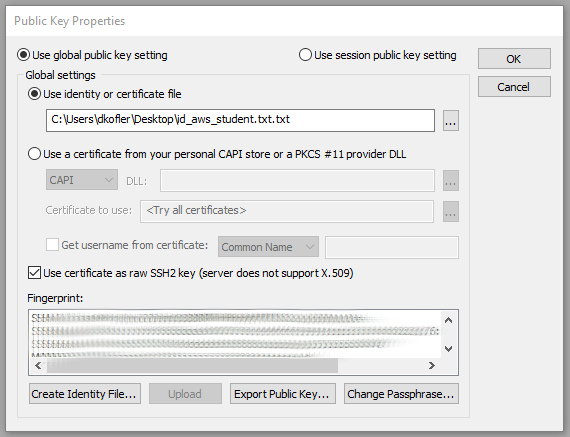
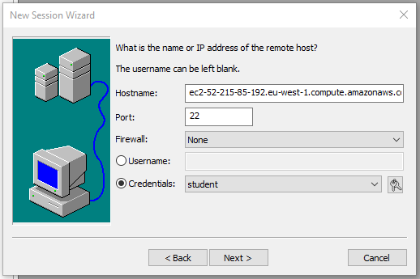
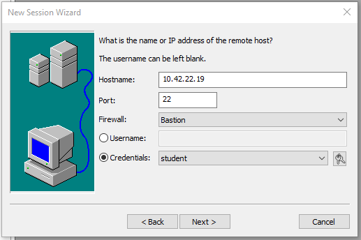
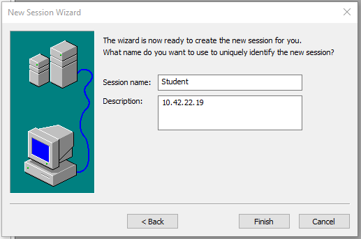
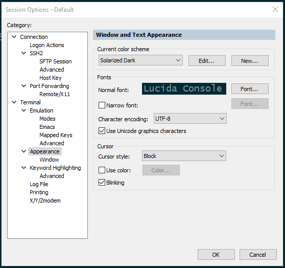

# Connect via SSH

## SecureCRT
SecureCRT can be downloaded here: [SecureCRT](https://www.vandyke.com/cgi-bin/releases.php?product=securecrt)

### During the installation, select "Without a configuration passphrase".  

### Go to Help - Enter Lincense Data and paste the license key provided.

### Go to Tools - Manage saved credentials and add the private key

### Create the bastion host session by clicking the plus sign in the session manager

### Create the student session

### (Optional) Go to Options - Edit default session to edit the theme

