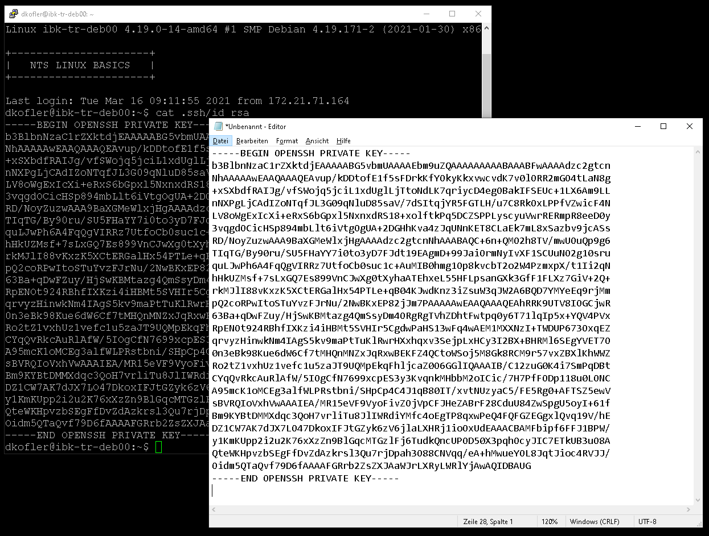
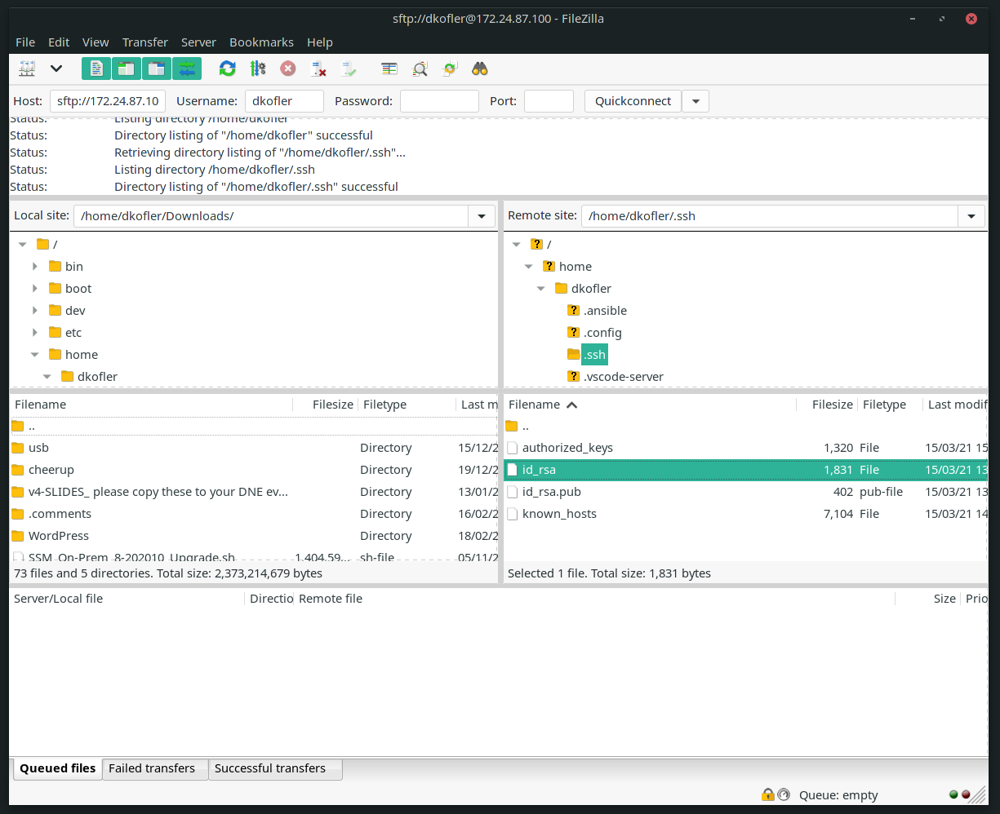
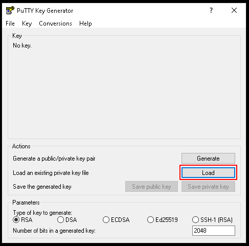
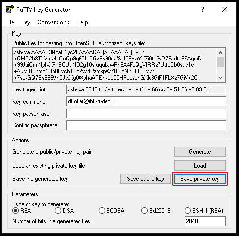
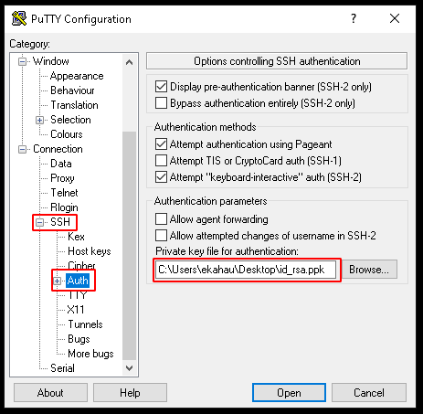
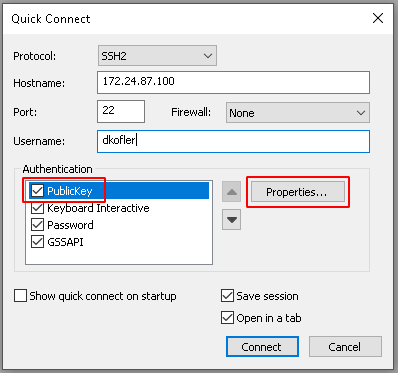
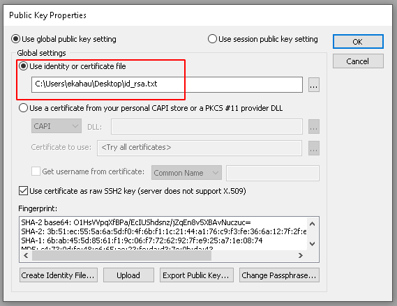

# Install SSH key
## Commands
Use the following commands to navigate through the filesystem:

| Command | Description |
| --- | --- |
| wget | transfer files from url |
| tar | compress / extract files |
---

## Tasks
### 1. Generate a new public / private key pair
**`ssh-keygen -t rsa -b 2048`**  
Dont dave the key to the default directory, choose your home folder: ./id_rsa
```
dkofler@ibk-tr-deb00:~$ ssh-keygen -t rsa -b 2048
Generating public/private rsa key pair.
Enter file in which to save the key (/home/dkofler/.ssh/id_rsa): ./id_rsa
Enter passphrase (empty for no passphrase): 
Enter same passphrase again: 
Your identification has been saved in ./id_rsa.
Your public key has been saved in ./id_rsa.pub.
The key fingerprint is:
SHA256:yZssuGXzgUET/Qlw27D8p7maQ5+IjxxzdDfaSSTv/xM dkofler@ibk-tr-deb00
The key's randomart image is:
+---[RSA 2048]----+
|      ooo        |
|       +o=       |
|      o +oo..    |
|     . o oo+     |
|      . S o *    |
|     . =.+ X o E |
|    . Oo*o+.+   .|
|     =.Oooo. . . |
|    . o.=o.   ..o|
+----[SHA256]-----+
```

### 2. Create a new directory in your home folder called **.ssh**
### 3. Change the permissions of the directory, so that only you have rwx rights
### 4. Move the id_rsa and id_rsa.pub files to the .ssh directory
### 5. Check if the permissions of the id_rsa file are set to 600
### 6. Create a new file in the .ssh directory called **authorized_keys**
### 7. Copy the content of the id_rsa.pub file to the authorized_keys file
### 8. Set the permissions of the authorized_keys file so that only you have rw rights
### 9. Copy the contents of the id_rsa file to your local machine
* You can just print the content and copy/paste it to a notepad file
* Use Filezilla or WinSCP to copy the whole file to your computer  
  
  

### 10. Generate and import putty ppk file (jump to the next task if you are using SecureCRT)
Open PuttyGen and import your id_rsa file  
  

Save your private key to a ppk file  
  

Add the key to your putty session  
  

### 11. Import key to SecureCRT
Create a new session and edit the PublicKey Properties  
 

Select the key file you created in the previous steps  
 

### 12. Connect to your Linux server without a password